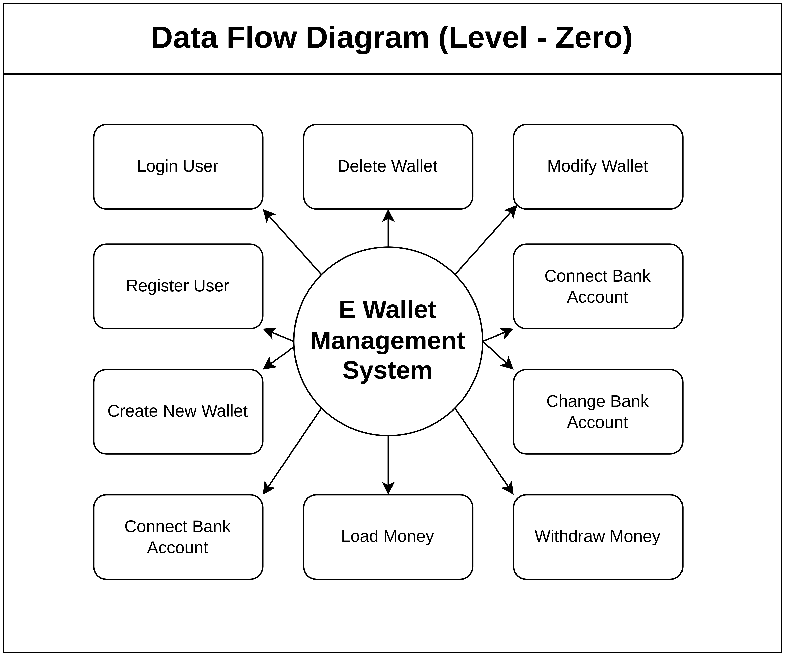
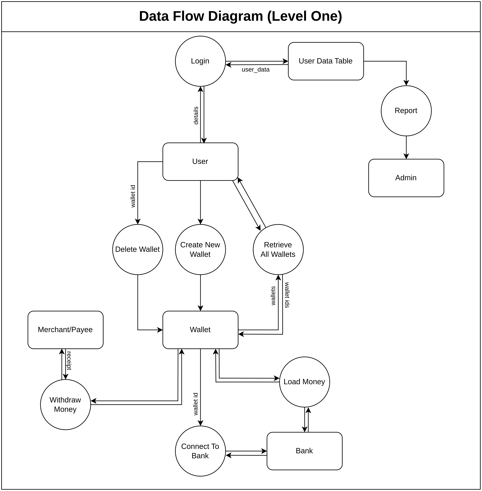

# e_wallet_management_system
Purpose - Software Engineering Lab Practical

```
Name -> M K Lino Roshaan
Roll No -> 2K22/MC/87
```

## Prerequisites
1. miniconda - Version 23.1.0 [[Download](https://docs.anaconda.com/miniconda/miniconda-install/)]
2. Python - Version 3.11 [[Download](https://www.python.org/downloads/)]

## Local Deployment

1. `conda create --name e_wallet python=3.11`
2. `conda activate e_wallet`
3. `pip install -r requirements.txt`
4. `flask run`

## Data Flow Diagrams

### DFD Level Zero
<kbd>  </kbd>

### DFD Level Zero
<kbd>  </kbd>
